# Azure Foundation Lite

version: 1.0.0.0

## Prerequisites

1. Install AzureRM modules

```powershell
Find-Module -Name AzureRM | Install-Module -Scope AllUsers -Force -AllowClobber
```

2. Install Azure.Storage module

```powershell
Find-Module -Name Azure.Storage | Install-Module -Scope AllUsers -Force -AllowClobber 
```

3. Create user, group or service principal in Azure AD that will have full access to the Azure Key Vault Deployed. Use the the Get-AzureRmADUser, Get-AzureRmADGroup or the Get-AzureRmADServicePrincipal cmdlets to get the object ID.

## Deployment Steps  

1. Edit azuredeploy.parameters.json and azuredeploymanagement.parameters.json in `project\AzureFoundationLite`
2. Run deploy.ps1 script with values for parameters ResourceGroupName,  ResourceGroupLocation and MGMTResourceGroupName
3. When you run it you will be asked to login to Azure.
4. When you are logged in you will be asked to choose a subscription for deploying the resources.
5. After successful deployment the following resources are created

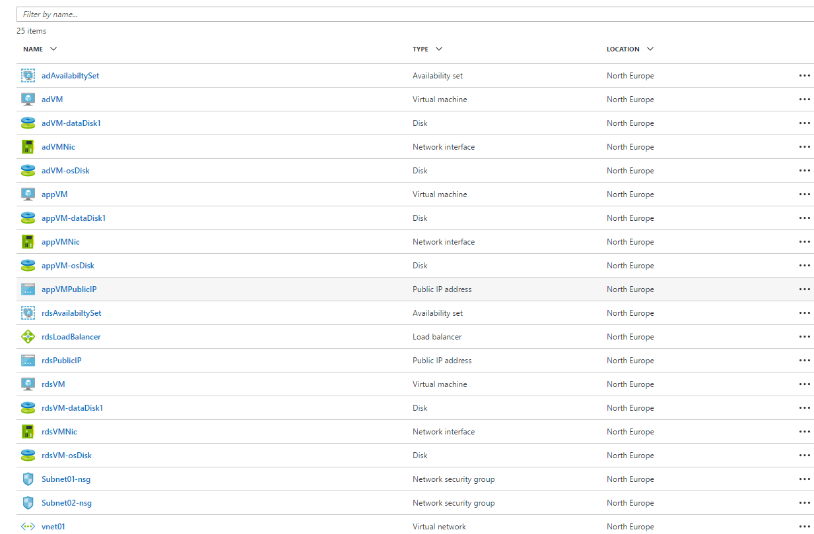

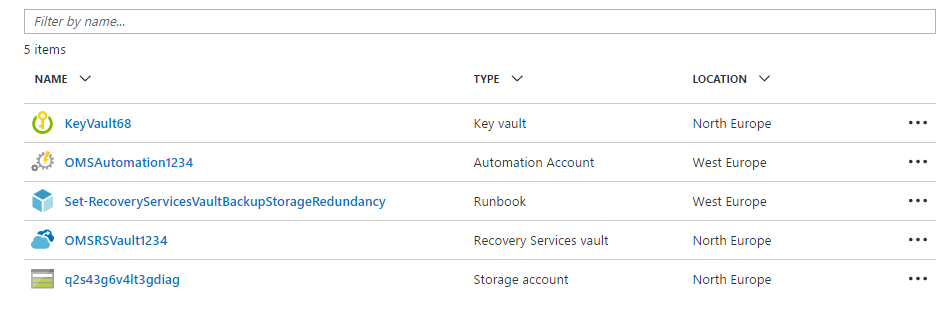

VM Diagnostics are configured with the following settings:

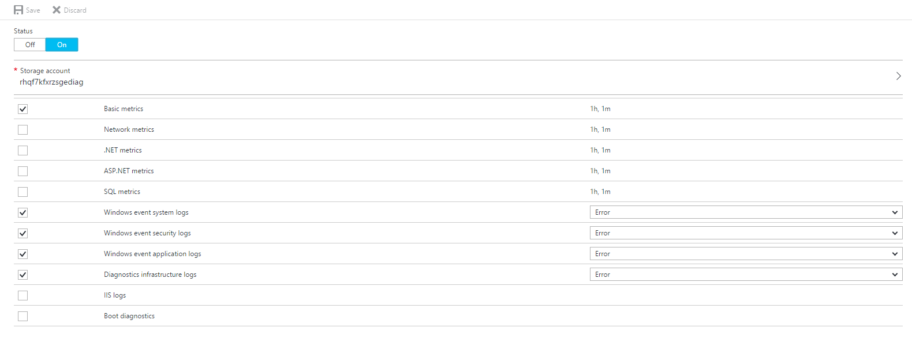

The following secrets are added to the Key Vault:

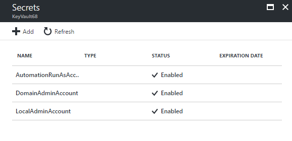

The secrets have the following structure. Additional properties like User Name and Domain name are stored in Tags.

**AutomationRunAsAccount**

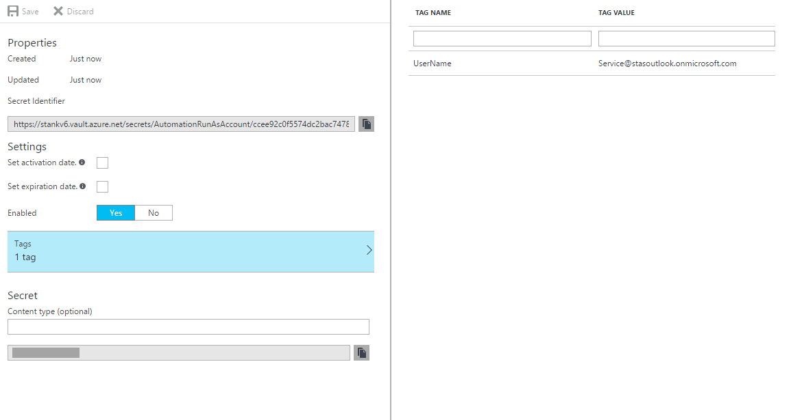

**DomainAdminAccount**

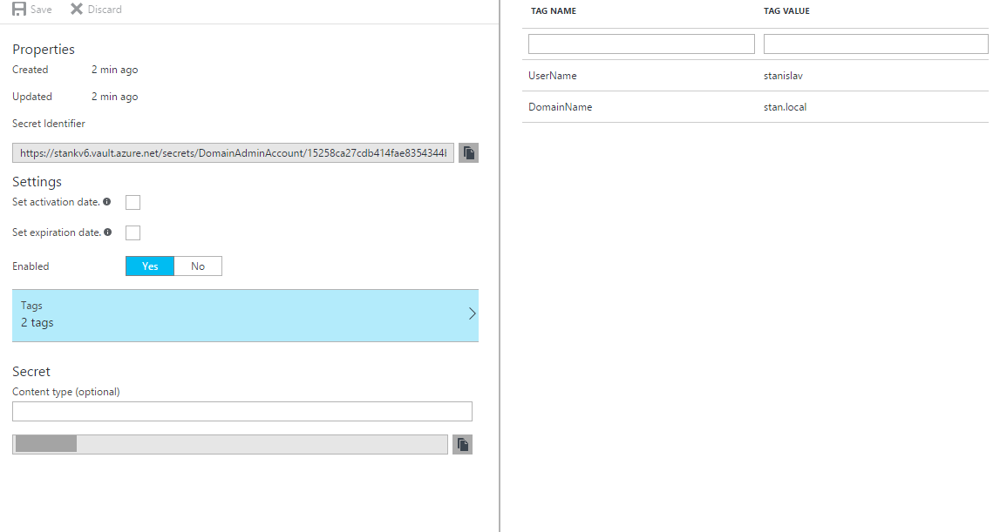

**LocalAdminAccount**

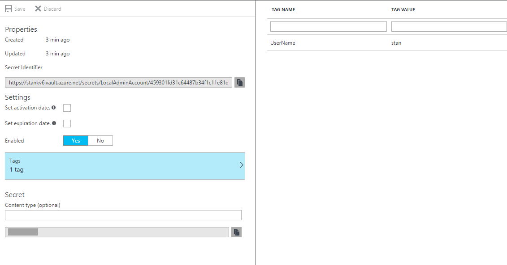

The following Network security rules are configured:

**Subnet01-nsg**

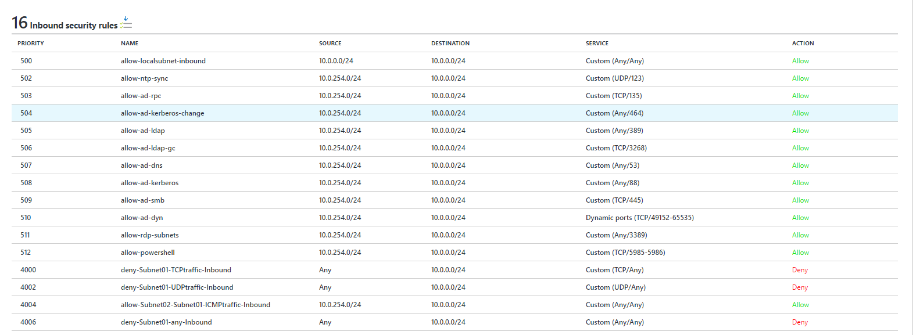
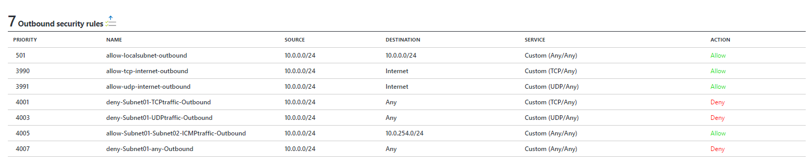

**Subnet02-nsg**

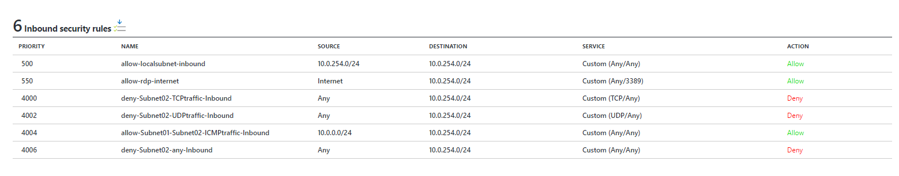
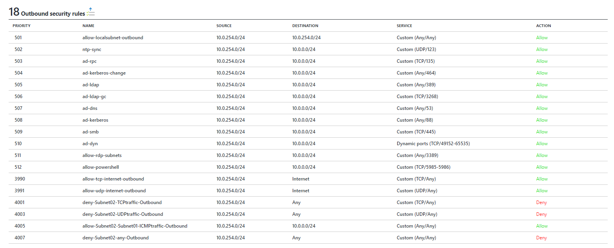


## Known Errors

1. If you have Azure SDK installed before installing/updating the Azure.Storage or AzureRM and recive the following error;
```powershell
    PackageManagement\Install-Package : Cannot process argument transformation on parameter 'InstalledModuleInfo'. Cannot convert the     "System.Object[]" value of type "System.Object[]" to type "System.Management.Automation.PSModuleInfo".
Find-Module -Name Azure.Storage | Install-Module -Scope AllUsers -Force -AllowClobber 
```

You might want to try to delete Azure* folders from below locations.

%ProgramFiles%\WindowsPowerShell\Modules folder
%ProgramFiles(x86)%\Microsoft SDKs\Azure\PowerShell

## Release Notes

### 1.0.0.0

- Added Network Security Groups for Subnet01 and Subnet02
- Placed rdsVM to Subnet02
- Renamed comments in main template to sequencing numbers
- Updated documentation